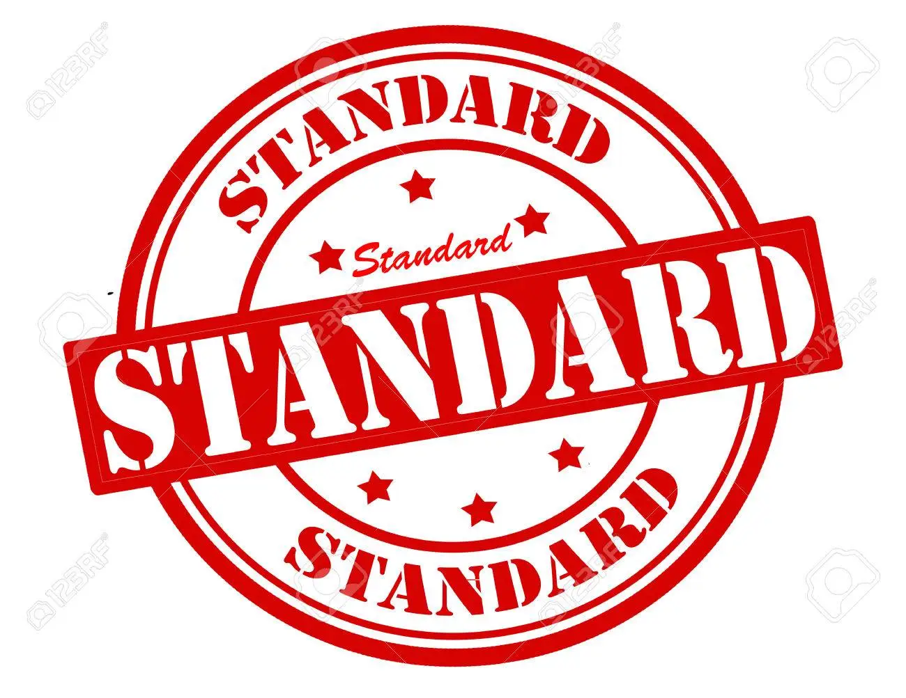

## A standard that one must follow...

It all start with a standard that one must follow but an industry that follows it is something to be feared since it becomes a new "normal". While it is true that it is tried and tested, it can be crux for many people on learning since it allows for predefined rules and ideas. I believe that that there is wisdom in order or having a standard but it helps if there was more information on how it would relate to learning a programming language. Even though I have doubts that I will not be very fast on learning these standards. It is because of how alien it is to have standards that seems to favor experimentation.

## Rough start in a winding road...
My experience with ESLint with Intellij is rough since it seems to act like autocorrect on phones where one would see the big red lines everywhere. I admit, this is very interesting tool to have since many IDE's need you to run for coding standards and ultimately come up with nothing. In the first week, I learned that many things can have shortcuts and keywords that allow a person to quickly churn out a code. I believe it comes down to two things that seems to be the case which is the quality of life on having conviences and faster work on churning out code. Getting those green checkmark is useful but somewhat misleading since it could mean a plethora of things since it could mean that you everything in order but it falls flat somewhere in your code.
