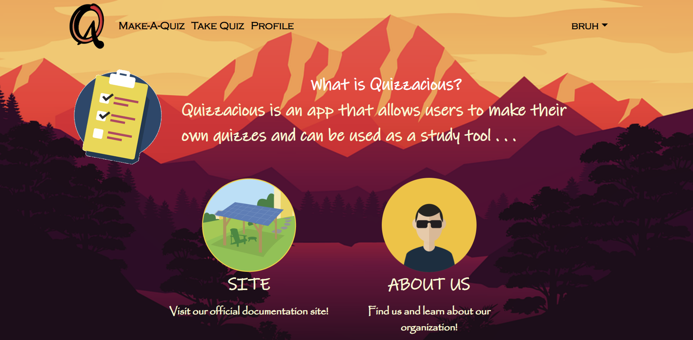
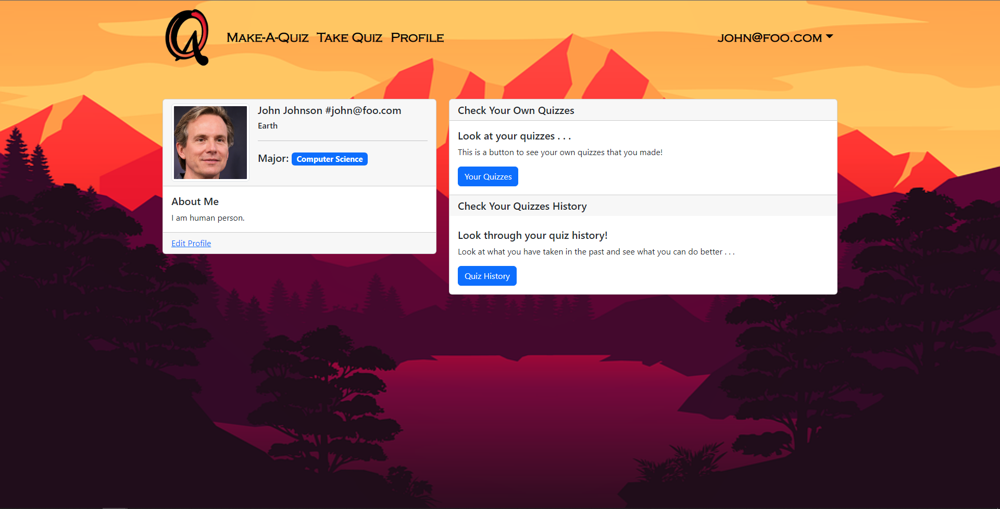

This is the final project ICS314 that was about making an app where it performed simple functions like saving certain objects and having functionalities in them. Our project was named quizzacious which is means "quizzes are delicious" since it plays on wanting something so badly. 

In my part, I did many of the ui design for this project such as the landing page and the profile page. In landing page, I changed the background and decided what type of font would look good but still maintaining structure and functionality. It was mostly decided that the look of the page should at least be undertandble 

I also did the Profile page components and as well as the design because the overall solution was to make the profile page look at least presentable. I did this by looking at some website for ideas because it was easier to simply "copy" the look of the profile card. It is important to understand the profile card important because while it was possible to make it with containers. It was rather difficult

I learned a lot about this assignment and realize that will be more projects like these in the future when I get into the industry. But maybe not on the front-end side of things but somewhere in between.

[Source](https://quizzacious.github.io/)
