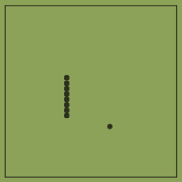

Real time snake was a game that was made in EE160 with my teammates it took the same retro fun as the 90's version but we used real time. This project was our final project for EE160 and we had many choices to make different kinds of games. It was a group project of three people that had different types of jobs or roles in the project. I did the debbugging and testing for the project but did some work on the code as well as concept design. The assignment was to create a game that our professor will enjoy for at least 5 mins without having massive bugs. This meant that to get an A for the project we needed to simplify the game to make sure that bugs won't appear. Our reasoning is rather simple since many teams decided to make games that have many mechanics. We realize that debugging will be one of primary things that many teams will spend their time on.

The concept of this project was to explore 2D arrays as our final topics before ending the semester. The code was somewhat simpler than most people realize. We saved the snake as an array that keeps adding more arrays everytime that array eats something. To put it in code practice, it would be like running a for loop that keeps adding an array into the main array which was the snake. Also, the 

The difficulty of the assignments mostly came from design and the fact that it needed to run in real time. I believe we achieved this through using the sleep function. In the beggining the project was difficult since we could not understand how to achieve this task. Making the arena or the UI design for it was fine and did not take a lot of time to do. But the overall function of the snake worked and with some help from our professor and the TA's we achieved our goal. 

I learned the importance of different people doing different to achieve a single goal which was the snake game. As well as the importantance of how to keep striving for better. During the project most of us were content with the design of the game and did not really mind that the game was more turn-based than real time. But we realize that it would feel like a cowardly to give up on something that could always be better and that pushed us to create a real time game rather than turned based one.
